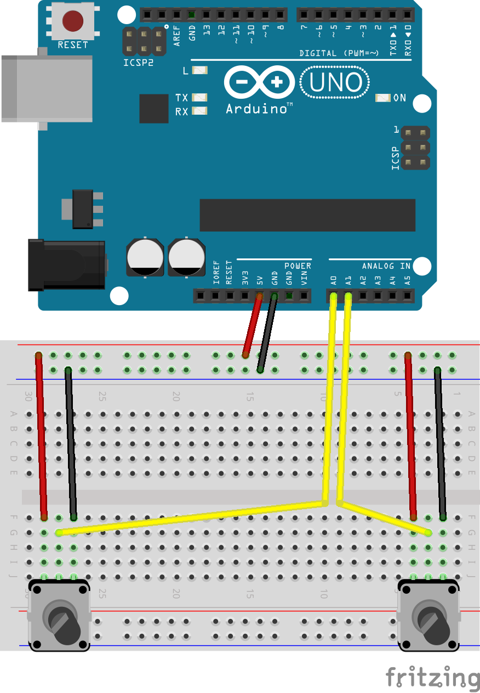

1. Build this circuit:

    

2. Connect the two servo motors to your Arduino: the two brown (ground) wires should be connected to GND, the two red (power) wires to 5V, and the two orange (signal) wires to digital pins 9 and 10.